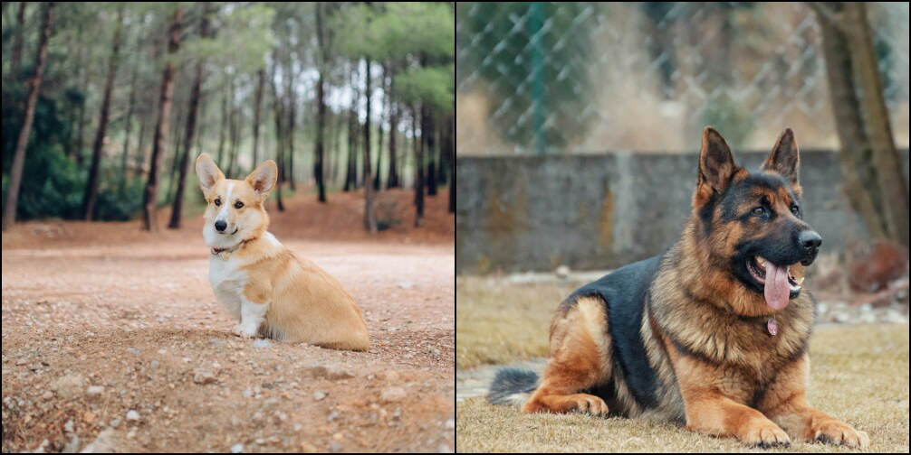
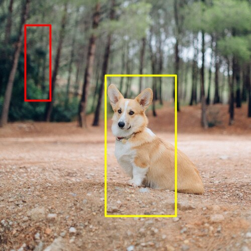
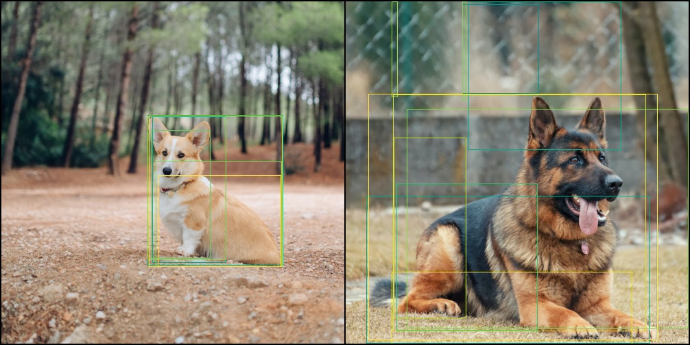
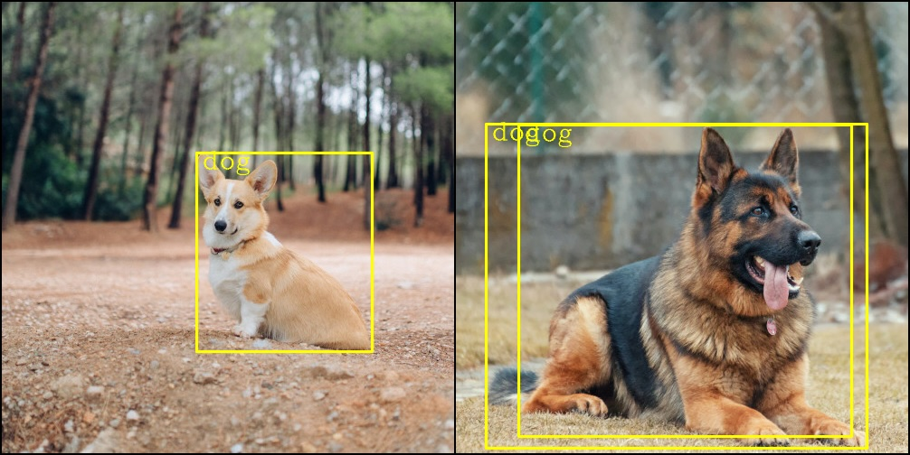
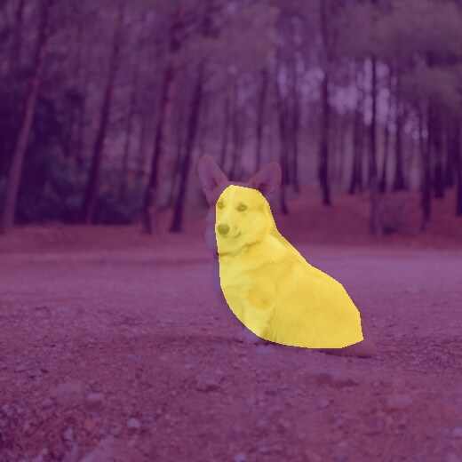
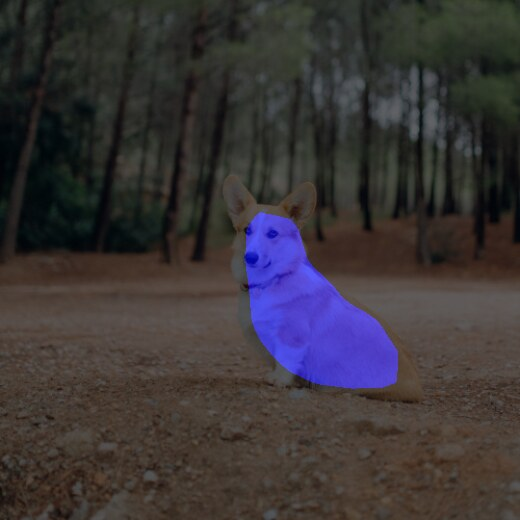
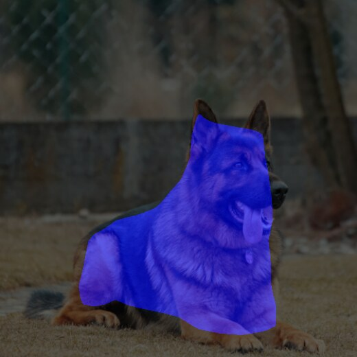
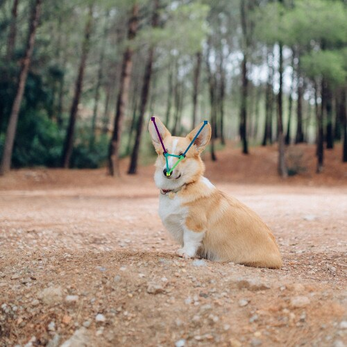

```{r, echo = FALSE}
knitr::opts_chunk$set(eval = FALSE)
```

This article walks through the drawing helpers shipped with torchvision
(`vision_make_grid()`, `draw_bounding_boxes()`, `draw_segmentation_masks()` and
`draw_keypoints()`) and shows how to feed them the output of a pretrained
detection or segmentation model. It follows the
[Visualization utilities](https://docs.pytorch.org/vision/stable/auto_examples/others/plot_visualization_utils.html)
tutorial from PyTorch.

The code below is not evaluated when the website is built, because it downloads
around 250 MB of model weights. Every figure was produced by running it.

```{r setup}
library(torchvision)
library(torch)

gallery <- "https://raw.githubusercontent.com/pytorch/vision/main/gallery/assets/"
dog1 <- base_loader(paste0(gallery, "dog1.jpg")) %>% transform_to_tensor()
dog2 <- base_loader(paste0(gallery, "dog2.jpg")) %>% transform_to_tensor()
```

## A grid of images

`vision_make_grid()` tiles a batch of images into a single tensor, which is a
quick way to eyeball a batch coming out of a `dataloader()`.

```{r}
grid <- vision_make_grid(dog1, dog2, per_row = 2)
tensor_image_browse(grid)
```



## Bounding boxes

`draw_bounding_boxes()` expects an `(N, 4)` tensor of boxes given as
`(xmin, ymin, xmax, ymax)` in absolute pixel coordinates.

```{r}
boxes <- torch_tensor(rbind(
  c(50, 50, 100, 200),
  c(210, 150, 350, 430)
), dtype = torch_float())

boxed <- draw_bounding_boxes(dog1, boxes, 
                             labels = c("tree", "partial corgi"), font_size = 18, 
                             colors = c("darkorange", "yellow"), width = 5)
tensor_image_browse(boxed)
```



## Object detection with RF-DETR

Boxes are usually not hand written but predicted. We will use the RF-DETR model to do so.
RF-DETR expects ImageNet-normalized inputs, so we assemble two images in a batch and then normalize.  
Note: The model is able to detect the dogs on unnormalized input, but with far lower confidence: the corgi confidence scores in the previous image drops from 0.67 with normalization down 0.28 without.

```{r}
norm_mean <- c(0.485, 0.456, 0.406)
norm_std <- c(0.229, 0.224, 0.225)

batch <- list(dog1, dog2) %>%
  torch_stack() %>% 
  transform_normalize(norm_mean, norm_std)

model <- model_rfdetr_base(pretrained = TRUE, num_queries = 40)
model$eval()
detections <- with_no_grad(model(batch))$detections
```

RF-DETR resizes the batch to its own working resolution internally and maps the
boxes back to the coordinates of the images you passed in, so images can be drawn
straight onto the original tensors. Each element of `detections` holds `boxes`,
`labels` and `scores` sorted by decreasing score. 

Let's first draw the objects detected with raw model output. 

```{r}
tensor_image_browse(vision_make_grid(
  draw_bounding_boxes(dog1, detections[[1]]$boxes),
  draw_bounding_boxes(dog2, detections[[2]]$boxes)
))
```


We can see that too many boxes are detected. RF-DETR Model default to 300 object detection, but we reduced it via the `num_queries` parameter. 

Let's filter them based on their associated confidence score.

We will create a convenience function that keeps the confident ones, and
turn the label indices into readable names out of `coco_classes()`.

```{r}
draw_high_confidence_bboxes <- function(image, detection, width = 4, font_size = 25, ...) {
  keep <- as.logical(as.array(detection$scores > 0.2))
  draw_bounding_boxes(
    image,
    detection$boxes[keep, , drop = FALSE],
    labels = coco_classes(as.integer(detection$labels[keep])), 
    width = width,
    font_size = font_size,
    ...
  )
}
```

Now let's draw again
```{r}
tensor_image_browse(vision_make_grid(
  draw_high_confidence_bboxes(dog1, detections[[1]], color = "yellow"),
  draw_high_confidence_bboxes(dog2, detections[[2]], color = "yellow")
))

```

  

## Semantic segmentation masks

`model_fcn_resnet50()` scores every pixel against the 21 PASCAL VOC classes. Its
pretrained weights are evaluated at 520 pixels, so resize before normalizing,
and keep the resized images around to draw on: masks and image must share their
height and width.

```{r}
resized <- list(dog1, dog2) %>%
  torch_stack() %>%
  transform_resize(size = c(520, 520)) 

batch <- resized %>%
  transform_normalize(norm_mean, norm_std)

model <- model_fcn_resnet50(pretrained = TRUE)
model$eval()
scores <- with_no_grad(model(batch))$out
```

`scores` is a `CPUFloatType{2,21,520,520}` tensor. Handeling such a tensor,
`draw_segmentation_masks()` takes the `argmax()` over the class dimension and
colors each class that appears.

```{r}
segmented <- draw_segmentation_masks(resized[1,..], scores[1, ..], alpha = 0.6)
tensor_image_browse(segmented)
```



To highlight a single class instead, build the boolean mask yourself. `dog` is
the 13th of the 21 classes, and softmax turns the scores into per-pixel
probabilities that can be thresholded.

```{r}
dog_masks <- nnf_softmax(scores, dim = 2)[, 13, , ] > 0.7

tensor_image_browse(vision_make_grid(
  draw_segmentation_masks(resized[1,..], scores[1, ..], alpha = 0.6, colors = "blue"),
  draw_segmentation_masks(resized[2,..], scores[2, ..], alpha = 0.6, colors = "blue")
  )
)
```




## Keypoints

`draw_keypoints()` takes an `(N, K, 2)` tensor holding the `(x, y)` location of
`K` keypoints for each of `N` instances. torchvision has no pose estimation
model to feed it (`model_mtcnn()` predicts five landmarks, but only on human
faces), so the keypoints here are annotated by hand: the two ear tips, the two
eyes and the nose of the corgi. `connectivity` lists the pairs of keypoint
indices to join with a line. Each line is drawn in the color of the keypoint it
starts from, so leave `colors` at its default or pass one color per keypoint.

```{r}
keypoints <- torch_tensor(rbind(
  c(220, 171),
  c(296, 176),
  c(239, 222),
  c(262, 226),
  c(242, 250)
), dtype = torch_float())$reshape(c(1, 5, 2))

connectivity <- list(c(1, 3), c(2, 4), c(3, 4), c(3, 5), c(4, 5))

posed <- draw_keypoints(dog1, keypoints, connectivity = connectivity,
                        radius = 6, width = 3)
tensor_image_browse(posed)
```


