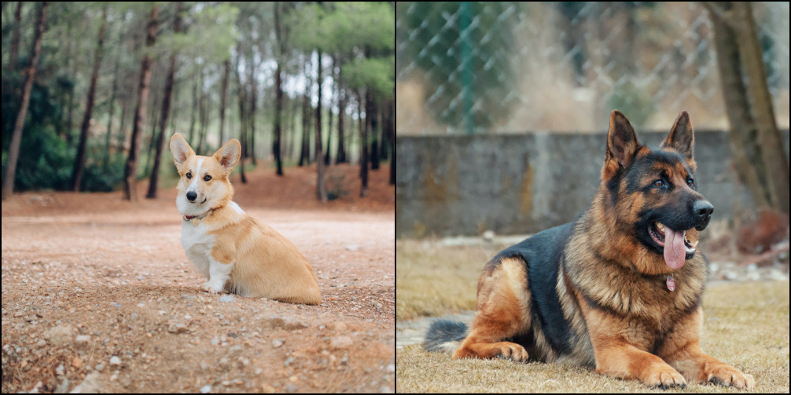
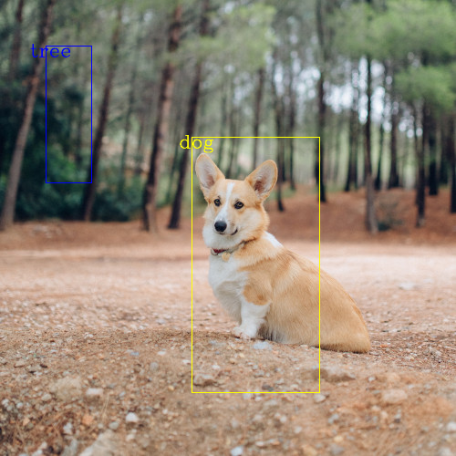

```{r, include = FALSE}
knitr::opts_chunk$set(
  collapse = TRUE,
  comment = "#>"
  
)
```

This vignette illustrates some of the utilities that torchvision offers for visualizing 
images, bounding boxes, segmentation masks and keypoints.

```{r setup}
library(torchvision)
library(torch)
library(magrittr)
```

## Visualizing a grid of images

In order to visualize a grid of images, we need a "image batch" i.e. a 4-D tensor of shape
$(B \times C \times H \times W)$, where B is the batch - 2 for a 2-images grid -, 
C is the image channels - 3 for the RGB color images -, H ad W the image pixel dimension.

The image batch is composed here using the `torch_stack()` command on a vector of tensors.

Then `tensor_image_browse()` will display the image in your usual image viewer.

```{r}
#| label: "image grid"
#| eval: false
dog1_tensor <- base_loader("examples/assets/dog1.jpg") %>% transform_to_tensor()
dog2_tensor <- base_loader("examples/assets/dog2.jpg") %>% transform_to_tensor()

grid <- vision_make_grid(torch_stack(c(dog1_tensor, dog2_tensor)))

tensor_image_browse(grid)
```
```{r, fig.alt = "An horizontal image grid made of two dog images"}

```

## Visualizing bounding boxes

We can use `draw_bounding_box()` to draw boxes on an image. We can set the colors, labels, width
as well as font and font size. The boxes shall be tensors of shape N, 4, each in $(x_{min}, y_{min}, x_{max}, y_{max})$ format.


```{r}
#| label: "draw_bounding_boxes"
#| eval: false

boxes <- matrix(c(50, 50, 100, 200, 210, 150, 350, 430), ncol = 4, byrow = TRUE)
boxes_tensor <- torch_tensor(boxes, dtype=torch_float())

# which is equivalent to the pure torch method using $view
boxes_tensor <- torch_tensor(c(50, 50, 100, 200, 210, 150, 350, 430), dtype=torch_float())$view(c(-1,4))

colors <- c("blue", "yellow")

labels <- c("tree", "dog")

result <- draw_bounding_boxes(dog1_tensor, boxes_tensor, colors=colors, labels = labels, width=5, font_size = 18)
tensor_image_browse(result)
```
```{r, fig.alt = "An sitting dog with two bounding boxes, one blue in the top left corner, one yellow over the dog forefront with a label `dog`"}

```


Naturally, we can also plot bounding boxes produced by torchvision detection models. Here is a demo with a Faster R-CNN model loaded from \code{fasterrcnn_resnet50_fpn()} model. For more details on the output of such models, you may refer to [Instance segmentation models](https://torchvision.mlverse.org/reference/#object-detection-models).

```{r}
#| label: "perform object detection"
#| eval: false

norm_mean <- c(0.485, 0.456, 0.406) # ImageNet normalization constants
norm_std  <- c(0.229, 0.224, 0.225)


# two images compose a batch of dimension (2, 3, H, W)
batch <- torch_stack(c(dog1_tensor, dog2_tensor), dim = 1) %>%
  transform_resize(c(520, 520)) %>%
  transform_normalize(norm_mean, norm_std)

model <- model_fasterrcnn_resnet50_fpn(
  pretrained = TRUE, score_thresh = 0.3, nms_thresh = 0.7, detections_per_img = 10
)

model$eval()

outputs <- model(batch)


```

